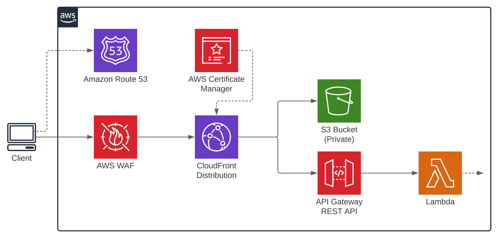

# 11ty-aws

11ty + Alpine + Tailwind on AWS.

Full stack javascript with very little context switching.

Yes, using Netlify is much eaiser and requires far less code, but some enterprises will not want to use Netilfy. Also, nontrivial sites will quickly need to have some APIs -- this stack uses cloudfront as an unified ingress for both the static site and the API Gateway.

## Getting Started

1. Configure your `awscli`
2. Update file `cdk/bin/static-site.ts`
3. Update domain name(s) in `cloudfront/static-rewrite.js`
4. `cd cdk && npm run cdk deploy StaticSiteInfra`
5. `npm run build`
6. `cd cdk && npm run cdk deploy StaticSiteDeploy`

### 11ty commands

```sh
npm install
# Dev
npm start
# Lint
npm run lint
# Build
npm run build
# Build and Preview
npm run build && npx serve dist
```

### aws-cdk commands

```sh
# CDK commands
cd cdk && npm install
# compile typescript to js
npm run build
# watch for changes and compile
npm run watch
# perform the jest unit tests
npm run test
# deploy this stack to your default AWS account/region
npm run cdk deploy staticSiteInfra
# deploy 11ty dist code to bucket
npm run cdk deploy staticSiteDeploy
# compare deployed stack with current state
npm run cdk diff
# emits the synthesized CloudFormation template
npm run cdk synth
```

### Directory structure

Mono-repo directory structure.

NOTE: Domain name config is repeated in a few spots:
- cdk/bin/static-site.ts
- cloudfront/static-rewrite.js
- src/_data/site.js

```sh
.
├── api # AWS Lambda handlers for api
├── cdk # AWS CDK stack for cloudfront and api
│   ├── bin # Cloudformation stack configuration
│   ├── lib # Cloudformation stack
├── cloudfront # AWS Cloudfront functions
│   ├── test-objects # json test cases for aws
├── dist # Output directory of final built site
├── public # Assets simply copied to the root of dist
├── src # Website source
│   ├── _data # Global data; automatically included
│   ├── _includes # Components and templates/layouts
│   ├── _styles # Post css source
│   ├── _scripts # Javascript source
│   ├── tailwind.css # Tailwind includes and custom style layers
├── .eleventy.js # Eleventy site generator settings
├── package-lock.json
├── package.json
└── tailwind.config.js # Tailwind CSS configurations (design tokens)
```

### Suggested VSCode Plugins

- lit-plugin - Rune Mehlsen
- PostCSS Language Support - csstools

## Todo

- Consolidate site domain name configs if possible
- Serverless
  - Lambda data processor --> kinesis data stream --> lambda builder --> s3
  - Could get expensive but follows the ssg ethos.
- Ditch AlpineJS for ???
  - I do not like the CSP unsafe-eval

## Flow Diagram



## Thanks

- [Adrian Hesketh](https://github.com/a-h) for publishing his [CDK source](https://github.com/aws-samples/serverless-patterns/tree/main/cdk-cloudfront-to-s3-and-lambda)

- [Matt Waler](https://mattwaler.com/) for his [eleventy starter](https://github.com/mattwaler/tea-stack)

- [Jim Nielsen](https://blog.jim-nielsen.com/2020/proptypes-outside-of-react-in-template-literal-components/) example of using prop-types in vanilla.js
